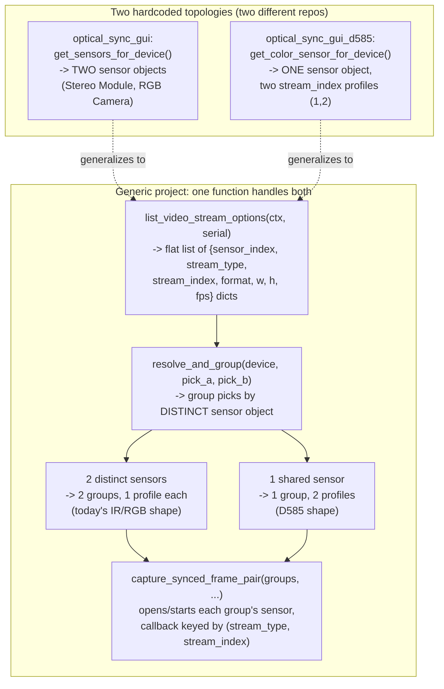

# Generic RealSense Sync Tester — Design

## Goal

Fork `optical_sync_gui` into a new, independent sibling project that treats "which two
video streams to compare" as a wizard *choice* instead of a hardcoded topology — so
IR-vs-IR (stereo module), IR-vs-RGB (dedicated sensor split), and color-vs-color (D585
Dual RGB) all run through one codebase, on any RealSense camera (old D400-series and new
D500-series alike), at any resolution/fps/format the device reports.

The two existing projects (`optical_sync_gui`, IR-vs-dedicated-RGB; `optical_sync_gui_d585`,
a sibling fork hardcoded to the D585's two color-sensor-index topology) are untouched.
Every new camera or stream combination today means forking the whole project again — this
project ends that cycle for the two topologies both existing projects already proved out.

## Background: what the two existing projects already solved, and what's still hardcoded

Reference: `docs/superpowers/specs/2026-07-28-d585-color-vs-color-fork-design.md` and
`docs/superpowers/plans/2026-07-28-d585-color-vs-color-fork.md` (both in this repo,
committed on this branch's predecessor `worktree-d585-fork-spec`) — the D585 fork already
generalized one dimension (adding a `stream_index` parameter to profile matching, opening
one shared sensor with two profiles instead of two separate sensors) but is still
hardcoded to exactly "two color streams, indices 1 and 2." This project generalizes one
level further: *which two streams, of any type, at any index* is a runtime choice.

Both existing projects' `engine/streams.py` prove the same underlying pattern works for
two different physical topologies:

- `optical_sync_gui`: `get_sensors_for_device` (`engine/streams.py:40-48`) returns a fixed
  `(stereo_sensor, rgb_sensor)` tuple — filtered by sensor *name* (`"Stereo Module"`,
  `"RGB Camera"`, `engine/streams.py:32`), each stream on its own sensor object.
- `optical_sync_gui_d585`: `get_color_sensor_for_device` returns a single sensor object
  exposing both stream indices — filtered by *stream_index* (`{1,2}.issubset(...)`), both
  streams sharing one sensor object.

Neither difference needs to exist in a generic design — `(stream_type, stream_index)` is
already the SDK's own canonical disambiguator for any profile on any sensor, so a single
keying scheme collapses both topologies into one code path.

## Confirmed scope decisions

- **New sibling directory** (e.g. `optical_sync_gui_generic`) — standalone, fresh git
  history, not modifying `optical_sync_gui` or `optical_sync_gui_d585`.
- **Video streams only**: `rs.stream.infrared` and `rs.stream.color`, any `stream_index`,
  any resolution/fps/format the device reports. No depth/motion/pose — every combination
  the LED-panel brightness-detection methodology can meaningfully support is a video
  stream; adding non-video streams was explicitly scoped out as unneeded complexity.
- **Exactly two streams** ("Stream A" / "Stream B"), user-picked at Stream Select time —
  not fixed to IR/RGB or left/right, not N-way (3+ simultaneous streams was considered and
  explicitly deferred).
- **D585-style firmware mode-switching**: reuse `engine/rgb_mode.py` from
  `optical_sync_gui_d585` as-is, wholesale (it's the only known camera-specific firmware
  quirk that matters today) — no new "quirk registry" abstraction. If a future camera
  needs a different quirk, extend then.
- **Camera controls**: user-configurable IR emitter/laser on-off, and auto vs. manual
  exposure + gain — both existing projects hardcode these (emitter always off, exposure
  always auto). Shown once per distinct *resolved sensor* (not once per stream), since
  both are sensor-level options and two picks might share a sensor.
- **No new module tree, no new class hierarchies** — plain dicts/tuples and functions,
  same shape both existing projects already use, so anyone who's read either can read
  this one. Two earlier, broader design passes explored a fully generic (any `rs.stream`
  type — depth, motion, pose) N-way architecture with dataclass hierarchies
  (`StreamSpec`/`ProfileKind`), a decode-registry class, and a quirk `Protocol` — this was
  explicitly rejected as overkill in favor of the scope above.

## Where the two existing topologies converge



`resolve_and_group` is the one genuinely new piece of logic — everything else in
`engine/streams.py` is today's functions gaining a `stream_index` parameter (already
proven safe: the D585 spec did exactly this to `list_supported_profiles`/`match_profile`)
or a straightforward tuple-args-to-picks rename.

## File-by-file plan

Grounded against the actual current source in this repo (line numbers as of this commit):

### `engine/streams.py` — the one file that changes meaningfully

- `list_devices(ctx)` (currently `:27-37`) — drop the `"Stereo Module"/"RGB Camera"`
  sensor-name filter (`:32`) entirely; list every connected RealSense device.
- `get_sensors_for_device` (`:40-48`) — replaced. New:
  `list_video_stream_options(ctx, serial) -> list[dict]`, looping
  `device.query_sensors()` → `sensor.profiles`, keeping only
  `profile.is_video_stream_profile()` entries where `stream_type() in
  (rs.stream.infrared, rs.stream.color)`. Each entry:
  `{"sensor_index": i, "stream_type": ..., "stream_index": ..., "format": ...,
  "width": ..., "height": ..., "fps": ...}` — a plain dict, not a dataclass. This is the
  flat list Stream Select's two combo pickers populate from.
- New: `resolve_and_group(device, pick_a, pick_b) -> list[(sensor, [profiles])]` — for
  each pick, find the sensor whose `.profiles` contains a matching
  `(stream_type, stream_index, format, width, height, fps)`; group by **distinct sensor
  object** (same object → one group with two profiles, D585 shape; different objects →
  two groups with one profile each, today's IR+RGB shape).
- `list_supported_profiles`/`match_profile` (`:51-74`) — gain a `stream_index` parameter
  (same change the D585 fork's spec already made to these two functions).
- `capture_synced_frame_pair` (`:77-164`) — currently hardcodes two sensors (`stereo_sensor`,
  `rgb_sensor`) keyed by `stream_type()` (`:106-117`). Generalize to accept the `groups`
  list from `resolve_and_group`, opening/starting each group's sensor with its profile(s);
  callback keys its per-stream state dict by `(stream_type, stream_index)` instead of
  `stream_type()` alone — required because two color picks (e.g. D585-style) would
  otherwise collide on `stream_type()` alone. The raw `sensor.open([profiles]);
  sensor.start(callback)` mechanism itself is unchanged (proven necessary — this file's own
  docstring at `:81-105` notes `rs.pipeline()` caused spurious zero-detections here).
- `disable_ir_emitter` (`:167-171`) — generalizes to `set_emitter_enabled(sensor, enabled:
  bool)`, called with whichever choice the user made instead of always `0`.
- `enable_auto_exposure` (`:174-181`) — gains a manual-exposure sibling:
  `set_manual_exposure(sensor, exposure: int, gain: int)`, called instead of
  `enable_auto_exposure` when the user picks Manual.
- `ContinuousCapture` (`:184-247`) — `__init__` takes `pick_a`/`pick_b` instead of
  `ir_resolution, ir_fps, color_resolution, color_fps` (`:190-194`); `start()`'s
  `config.enable_stream(...)` calls (`:198-200`) use each pick's own
  `stream_type`/`stream_index`/`width`/`height`/`format`/`fps`; `frames_with_diagnostics()`
  (`:208-242`) reads back via `frameset.get_infrared_frame(stream_index)` or
  `frameset.get_color_frame(stream_index)` depending on each pick's `stream_type` (both
  accessors already take an index in the SDK — no frameset iteration needed).
- D585 mode-switch: copy `engine/rgb_mode.py` from `optical_sync_gui_d585` unchanged;
  Device Select calls it exactly the way that project already does, when applicable.

### `engine/stream_preview_thread.py` — backs Stream Config's live preview, equally hardcoded

Imports `disable_ir_emitter`/`get_sensors_for_device` (`:13`); constructs
`ContinuousCapture(ir_resolution, ir_fps, color_resolution, color_fps)` (`:49`); reads
`ir_image, rgb_image, ir_ts_us, rgb_ts_us, ir_frame_number, color_frame_number` from
`frames_with_diagnostics()` (`:53`); calls `draw_bundle_overlay` with `ir_ts_us`/`rgb_ts_us`
naming (`:66-69`). Needs the identical generalization pass as `streams.py`: constructed
with `pick_a`/`pick_b` and a resolved sensor/group from `resolve_and_group`, reading back
via whichever `ContinuousCapture` now yields, renamed to `stream_a_*`/`stream_b_*`
throughout. This file was easy to miss (it's not a wizard page or an obviously
"IR/RGB-named" file), so it gets its own explicit task in the implementation plan rather
than being folded into "engine/streams.py".

### `domain/realsense_utils.py` — one small decode dispatch instead of two hardcoded functions

Replace `ir_bytes_to_image`/`yuyv_to_bgr` (`:101-107`) with:

```python
DECODERS = {
    # Infrared formats
    rs.format.y8:    lambda b, w, h: np.frombuffer(b, np.uint8).reshape((h, w)).copy(),
    rs.format.y16:   lambda b, w, h: np.frombuffer(b, np.uint16).reshape((h, w)).copy(),
    # Color formats — a color sensor can report any of these depending on model/driver
    rs.format.yuyv:  lambda b, w, h: cv2.cvtColor(np.frombuffer(b, np.uint8).reshape((h, w, 2)), cv2.COLOR_YUV2BGR_YUYV),
    rs.format.uyvy:  lambda b, w, h: cv2.cvtColor(np.frombuffer(b, np.uint8).reshape((h, w, 2)), cv2.COLOR_YUV2BGR_UYVY),
    rs.format.bgr8:  lambda b, w, h: np.frombuffer(b, np.uint8).reshape((h, w, 3)).copy(),
    rs.format.rgb8:  lambda b, w, h: cv2.cvtColor(np.frombuffer(b, np.uint8).reshape((h, w, 3)), cv2.COLOR_RGB2BGR),
    rs.format.bgra8: lambda b, w, h: cv2.cvtColor(np.frombuffer(b, np.uint8).reshape((h, w, 4)), cv2.COLOR_BGRA2BGR),
    rs.format.rgba8: lambda b, w, h: cv2.cvtColor(np.frombuffer(b, np.uint8).reshape((h, w, 4)), cv2.COLOR_RGBA2BGR),
    rs.format.mjpeg: lambda b, w, h: cv2.imdecode(np.frombuffer(b, np.uint8), cv2.IMREAD_COLOR),
}

def decode_frame(raw_bytes, fmt, width, height):
    if fmt not in DECODERS:
        raise RuntimeError(f"No decoder for format {fmt} - pick a different format in Stream Select, or add one to DECODERS.")
    return DECODERS[fmt](raw_bytes, width, height)
```

Stream Select's format dropdown only ever offers formats the connected sensor actually
advertises (from `list_video_stream_options`'s per-entry `format`), so `decode_frame` only
ever needs to handle real device output, never a guess; the explicit `RuntimeError` fails
loudly instead of a silent/confusing crash.

`draw_bundle_overlay` (`:133-151`) renames `ir_frame_number/color_frame_number/ir_ts_us/
color_ts_us` to `stream_a_frame_number/stream_b_frame_number/stream_a_ts_us/stream_b_ts_us`,
and its printed labels from `"IR Frame"`/`"Color Frame"`/`"IR Timestamp"`/`"Color
Timestamp"` to generic `"Stream A"`/`"Stream B"` labels.

Everything else in this file (`sample_neighborhood_brightness`, `apply_roi_mask`,
`crop_to_roi`, `merge_close_centroids`, `detect_led_centroids`, `save_debug_detection_image`,
`draw_led_state_overlay`) is confirmed format-agnostic already — no change.

### `engine/metrics.py`, `engine/test_session.py`, `engine/acquisition_loop.py` — rename only, zero logic change

Same rename the D585 fork already validated is safe, just to `stream_a_`/`stream_b_`
instead of `left_`/`right_`:

- `FramePairSample(pair_index, ir_ts_us, rgb_ts_us, ir_bright=None, rgb_bright=None)`
  (`engine/metrics.py:20-25`) → `stream_a_ts_us/stream_b_ts_us/stream_a_bright/stream_b_bright`.
- `PairingGapMetric.update` (`:111-119`): `gap = sample.ir_ts_us - sample.rgb_ts_us` (`:112`)
  → `sample.stream_a_ts_us - sample.stream_b_ts_us`.
- `PositionGapMetric` (`:135-189`): constructor params `ir_threshold, rgb_threshold, ...,
  ir_fps, rgb_fps` (`:138-139`) → `stream_a_threshold, stream_b_threshold, ...,
  stream_a_fps, stream_b_fps`; `last_ir_on_mask`/`last_rgb_on_mask` (`:157-158`) →
  `last_stream_a_on_mask`/`last_stream_b_on_mask`; `_prev_ir_ts`/`_prev_rgb_ts` (`:148-149`)
  → `_prev_stream_a_ts`/`_prev_stream_b_ts`; `ir_frame_drop`/`rgb_frame_drop` extra keys
  (`:167`) → `stream_a_frame_drop`/`stream_b_frame_drop`.

Zero logic change — the math (`compute_position_gap`, `find_last_on_led`,
`_is_frame_drop`) is already fully symmetric between its two operands, confirmed by
reading it in full.

### `domain/calibration.py` + `config.yaml` — per-stream keys, not per-pair

`update_config_leds`/`load_led_positions` (`:47-81`) currently key each camera by a fixed
`"ir"`/`"rgb"` sub-dict (`:53-63`, `:80`). Move to per-stream slugs computed in
`engine/streams.py` (e.g. `infrared1`, `infrared2`, `color`, `color2` — derived from
`stream_type`+`stream_index`, since that's the only file that talks to `pyrealsense2`):

```yaml
leds:
  Intel RealSense D455:
    infrared1:
      frame_width: 1280
      frame_height: 720
      positions: {...}      # unchanged [x, y, on_value, off_value, threshold] shape
    color:
      frame_width: 1280
      frame_height: 720
      positions: {...}
```

Each stream's calibration stands alone — simpler than a joined pair-key (an earlier,
rejected design pass proposed pair-keys), and means recalibrating one stream doesn't
invalidate the other's data. `update_config_leds`/`load_led_positions` keep their existing
two-named-argument shape (`ir_positions, ir_res, rgb_positions, rgb_res` →
`stream_a_positions, stream_a_res, stream_b_positions, stream_b_res`), just with the slug
as a runtime string instead of the literal `"ir"`/`"rgb"`. `assign_grid_ids` (`:14-34`) and
`build_positions_with_thresholds` (`:37-44`) are confirmed unchanged — pure pixel math with
zero stream-name coupling.

### `state/gui_state.py` + `settings.yaml`

`GuiState`'s fields (`state/gui_state.py:16-24`): `ir_fps, ir_width, ir_height, rgb_fps,
rgb_width, rgb_height, ir_roi, rgb_roi` become `stream_a_type, stream_a_index,
stream_a_width, stream_a_height, stream_a_fps, stream_a_roi` + `stream_b_*` equivalents,
plus new camera-control fields: `stream_a_emitter_enabled: "bool | None"`,
`stream_a_auto_exposure: bool = True`, `stream_a_exposure: "int | None"`,
`stream_a_gain: "int | None"` (and the same four for `stream_b`). `load_gui_state`/
`save_gui_state` (`:27-41`) need zero changes — already generic via
`dataclasses.fields`/`dataclasses.asdict`.

`settings.yaml`'s `camera:` block (`:9-15`) — `ir: {width, height, fps}` / `color: {width,
height, fps}` becomes `stream_a: {stream_type, stream_index, width, height, fps}` /
`stream_b: {...}` as an optional preferred-default, same soft-preselect semantics as
today (skipped if the connected device doesn't report that exact combo).

### `gui/main_window.py` — the thick wiring layer doing most of the IR/RGB-specific orchestration

- `_on_device_chosen` (`:51-62`): `stereo_sensor, rgb_sensor = get_sensors_for_device(...)`
  (`:55`) → resolve sensor options via `list_video_stream_options`; `camera_settings["ir"]`/
  `["color"]` (`:57-60`) → `camera_settings["stream_a"]`/`["stream_b"]`;
  `stream_config_page.populate(...)` call passes the flat stream-option list instead of two
  fixed sensor objects.
- `_on_config_chosen` (`:64-74`): destructures `ir_width, ir_height, ir_fps, rgb_width,
  rgb_height, rgb_fps = config` (`:65`) — becomes two `pick_a`/`pick_b` dicts (full
  stream identity, not just resolution/fps, since the stream *type*/*index* is now a
  runtime choice too). This is also where `resolve_and_group(device, pick_a, pick_b)` runs
  and the once-per-distinct-sensor emitter/exposure controls (already gathered on Stream
  Select) get applied, before proceeding to ROI Select.
- `_on_roi_chosen` (`:76-96`) and `_on_calibration_done` (`:98-149`): both destructure
  fixed `ir_*`/`rgb_*` tuples end to end, including building `ir_threshold`/`rgb_threshold`
  arrays (`:127-128`) and the LED-count-mismatch warning message (`:110-119`, currently
  literally "IR LED(s)"/"RGB LED(s)"). All renamed to `stream_a_*`/`stream_b_*`
  equivalents; the warning message becomes generic (e.g. "Stream A" / "Stream B" or the
  actual human label from `stream_label(...)`).

### `gui/pages/*.py` — same 5-step wizard shape

- **Device Select**: no ir_/rgb_-specific naming today (confirmed); gains the D585
  mode-switch call only when `engine/rgb_mode.get_mode(device)` says it applies.
- **Stream Select** (renamed from Stream Config): two `QComboBox` pairs — "Stream A:
  [stream/format dropdown] [resolution+fps dropdown]" and the same for "Stream B" —
  populated from `list_video_stream_options`. Same two-controls-per-side shape as today's
  `ir_combo`/`rgb_combo`, data-driven instead of hardcoded. Plus the new camera-control
  section: emitter on/off and auto/manual-exposure+gain, shown once per distinct resolved
  sensor (via `resolve_and_group`, computed as soon as both streams are picked).
- **ROI Select / Calibration**: same two-branch code as today, using whichever two
  streams were picked, decoded via `decode_frame`, labeled via one small
  `stream_label(stream_type, stream_index) -> str` helper (e.g. `"Infrared 1"`,
  `"Infrared 2"`, `"Color"`) instead of hardcoded "IR"/"RGB" strings — same role as the
  existing `_short_camera_name` helper in `gui/pages/live_session_page.py`.
- **Live Session**: same two-video-panel/two-plot-series layout as today, labels from
  `stream_label(...)`.

### No changes (confirmed generic by grep across the whole repo for `ir_`/`rgb_` — zero matches)

`domain/csv_export.py`, `gui/widgets/stats_panel.py`, `gui/widgets/live_plot.py`,
`gui/widgets/video_panel.py`, `domain/plot_export.py`, `domain/running_stats.py`,
`engine/led_panel.py`.

## Testing plan

Same fakes-based style already proven in `tests/engine/test_streams.py` (both here and in
the D585 fork's rewritten version):

- `list_video_stream_options` against a fake device with mixed video/non-video profiles —
  confirms non-video streams are correctly excluded, not crashed on.
- `resolve_and_group` against (a) a fake with two distinct sensors (today's IR+RGB shape)
  and (b) a fake with one shared sensor exposing two stream indices (D585 shape) —
  confirms both group correctly through the same function.
- `capture_synced_frame_pair` against the `groups` list shape, using the same
  `_FakeStreamingSensor`-style background-thread fake both existing projects already use
  (so the reset-then-wait-for-fresh-frames control flow is genuinely exercised, not
  trivially satisfied).
- `decode_frame` against each format in `DECODERS`, plus the `RuntimeError` for an
  unhandled format.
- `set_emitter_enabled`/manual-exposure option calls tested the same way both existing
  projects already test `disable_ir_emitter`/`enable_auto_exposure` — a `FakeOptionSensor`
  asserting the right `rs.option` key/value was set.
- `PairingGapMetric`/`PositionGapMetric` tests mirror the existing suites exactly, renamed.
- `pytest -v` with `QT_QPA_PLATFORM=offscreen`, same convention as both existing projects.

## Docs

New project's `CLAUDE.md`/`README.md` describe the stream-a/stream-b wizard-choice
architecture, the `resolve_and_group` same-sensor-vs-different-sensor unification, the
camera-control options, and reference `optical_sync_gui`/`optical_sync_gui_d585` as the
two topologies this project subsumes (not forks).

## Open risks to confirm against real hardware during implementation

- Whether `list_video_stream_options`'s enumeration (looping every sensor's `.profiles`)
  reliably reports every stream_index a device exposes in its *current* firmware mode —
  for a D585 still in Dedicated RGB mode, only stream index 0 (or similar) should appear
  until the mode-switch quirk runs; confirm Stream Select correctly reflects a mode change
  without a stale cached list.
- Whether `frameset.get_infrared_frame(stream_index)`/`get_color_frame(stream_index)`
  behave correctly when both `pick_a` and `pick_b` are the *same* `stream_type` (e.g. two
  infrared picks on a stereo module, or two color picks D585-style) — this is exactly the
  scenario `resolve_and_group`'s same-sensor grouping exists for, but the frame-retrieval
  accessors themselves have only been proven (via the D585 fork) for the color/color case,
  not yet for infrared/infrared.
- Manual-exposure value ranges (`rs.option.exposure`/`rs.option.gain`) are sensor- and
  model-dependent (different min/max per D400 vs D500 series) — the UI should query
  `sensor.get_option_range(rs.option.exposure)` rather than hardcoding a slider range, to
  stay generic across camera models; confirm this against real hardware for at least one
  D400 and one D500-series device.
